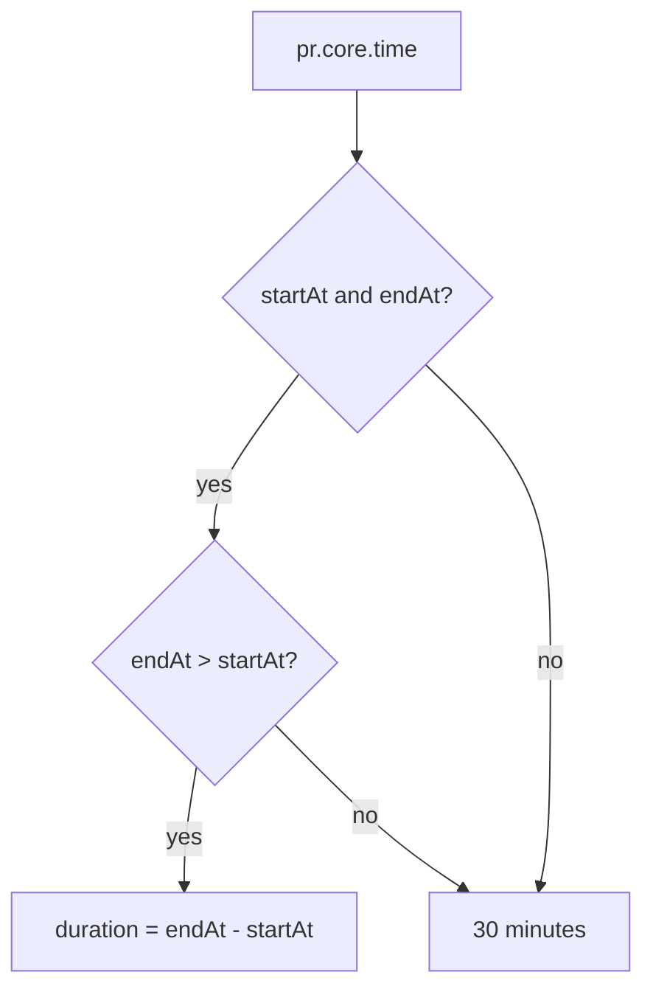
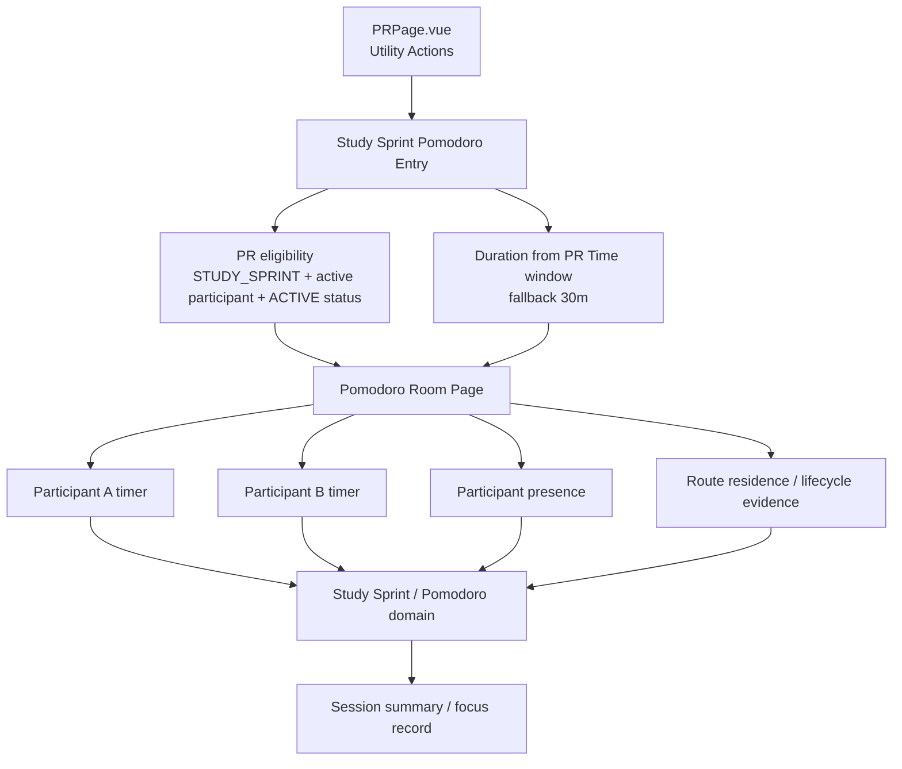
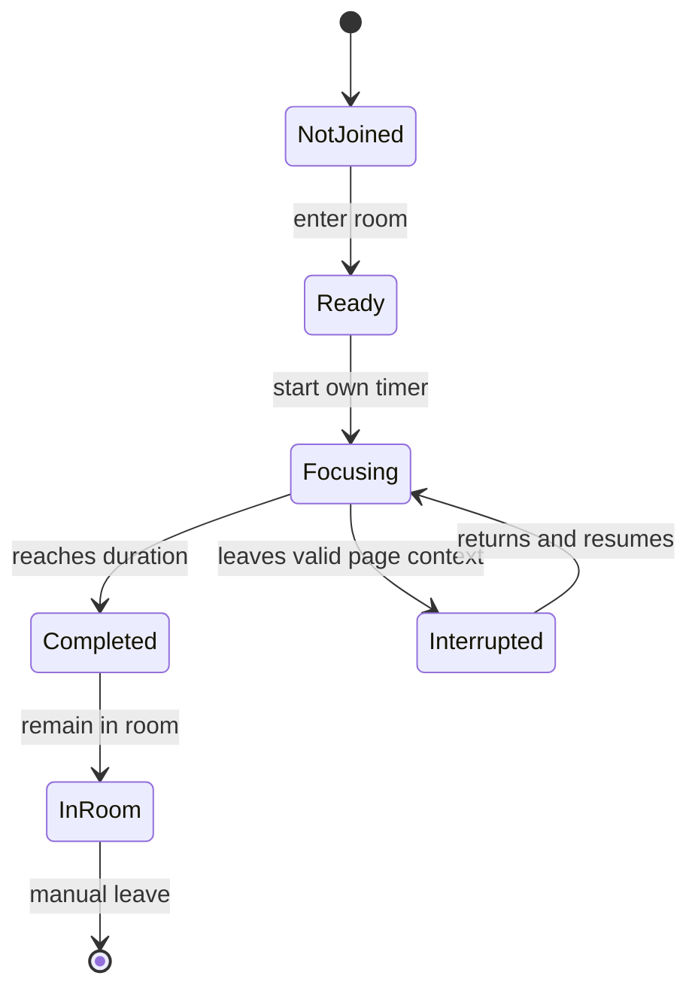

# Technical Topology And Constraints

## Current Code Anchors

- `apps/frontend/src/app/router.ts` owns the `/pr/:id` route to `PRPage`.
- `apps/frontend/src/pages/PRPage.vue` owns PR Page route assembly and the
  current Utility Actions stack.
- `apps/frontend/src/pages/PRPage.vue` already gates PR-context Button Placement
  on `prDetail.partnerSection.viewer.isParticipant`.
- `apps/frontend/src/domains/pr/queries/usePRDetail.ts` owns the frontend PR
  detail query and RPC response inference.
- `apps/frontend/src/domains/pr/model/types.ts` exposes `PRDetailView` from the
  backend RPC detail payload.
- `apps/backend/src/domains/pr/read-models/get-pr-detail.ts` owns the backend
  PR detail read model including `status`, `core.type`, and `partnerSection`.
- `apps/backend/src/domains/pr-core/services/partner-section-view.service.ts`
  derives `viewer.isParticipant` from the viewer's active PR partner identity.
- `apps/backend/src/repositories/PartnerRepository.ts` treats active
  participant summaries as `JOINED`, `CONFIRMED`, and `ATTENDED` partners.
- `apps/backend/src/entities/partner-request.ts` owns the PR status schema.
- `apps/backend/src/entities/partner.ts` owns the partner status schema.
- `apps/backend/seeds/0001_anchor_event_bootstrap.sql` already seeds an Anchor
  Event type `STUDY_SPRINT` for `自习搭子`.
- `tasks/pr-page-topology-audit/73-utility-actions-refactor-slice.md` records
  the current Utility Actions split into peer utility components.

## Domain Ownership

Candidate owner split:

- PR domain owns eligibility: only active participants of an `ACTIVE`
  `STUDY_SPRINT` PR may use the entry.
- Study Sprint / Pomodoro domain owns room surface, participant timer state,
  presence, and focus evidence.
- Notification domain may later own session-start reminders if needed.
- Analytics / BI may later receive aggregate focus-session events, but should
  not be the source of truth for participant records.

Visibility invariant:

- Room snapshot and participant aggregate state are readable only by current
  active participants of the owning PR.
- Raw session event ledger is not exposed to user-facing clients.
- Study Sprint data does not feed reliability, reputation, punishment, or PR
  participation-status transitions in MVP.

## Route Shape

Route candidates to decide:

- `/pr/:id/study-sprint` keeps the room visibly PR-attached.
- `/study-sprints/:prId` treats the feature as an independent room surface with
  a PR-backed eligibility source.
- A future non-PR room route should not be assumed unless product scope expands.

## Duration Derivation

The PR Page entry should derive duration from the PR detail payload:

Implementation note:

- Duration should be passed through the entry route or room bootstrap contract,
  but the future room should still be able to recompute or validate it from PR
  detail to avoid trusting only URL state.

## No-Phone Measurement Reality

Important constraint:

- A normal web page cannot prove physical no-touch behavior.
- It can approximate focus evidence from page lifecycle, visibility, route
  residence, heartbeats, and elapsed wall-clock time between lifecycle events.
- Screen-off can be counted by recording a timestamp before the page is paused
  or hidden, then crediting elapsed wall-clock time when the page resumes if the
  product defines that as valid.
- This does not prove the user did not interact through OS-level controls,
  another app, another device, or system notification surfaces.

Practical first model:

- Treat Pomodoro route residence as the main evidence source.
- Treat in-page touches as neutral because staying on the Pomodoro page is not
  touching phone for this product.
- Treat app switch / page hidden / route leave as an interruption unless the
  event is classified as screen-off and product policy says screen-off counts.
- Keep the recorded language at "focus evidence" until stronger platform
  evidence exists.

## Realtime Transport

Transport candidates:

- Short-polling: simplest, enough for MVP presence with coarse latency.
- Server-Sent Events: good for shared presence updates if backend runtime
  supports long-lived responses.
- WebSocket: best for live room state but adds infrastructure and test
  complexity.
- WebRTC: out of current scope because "video-call-like" is layout only.

## Preliminary Topology

## Candidate State Model

Each participant owns their own timer state:

Candidate participant evidence:

- `joinedAt`
- `timerStartedAt`
- `targetDurationMinutes`
- `lastSeenAt`
- `validResidenceStartedAt`
- `validResidenceAccumulatedSeconds`
- `interruptionAccumulatedSeconds`
- `interruptionEvents[]`

These names are provisional and should not be treated as schema decisions yet.

## Persistence Direction

Confirmed direction:

- Use an event ledger plus session aggregate fields.

Rationale:

- Event ledger preserves lifecycle evidence for debugging and future rule
  changes.
- Session aggregates keep the room snapshot cheap to read.
- No-phone semantics are still partly product-defined, so storing only final
  seconds would make later correction and explanation difficult.

Candidate tables:

- `study_sprint_rooms`
  - one room per PR for current scope
  - owns room lifecycle and PR reference
- `study_sprint_participant_sessions`
  - one current participant session per `(room_id, user_id)` in MVP
  - owns target duration, timer state, aggregate focus seconds, interruption
    seconds, completion timestamp, and last seen timestamp
- `study_sprint_session_events`
  - append-only evidence ledger
  - owns event type, occurrence time, client sequence, and typed payload

Repository candidates:

- `StudySprintRoomRepository`
- `StudySprintParticipantSessionRepository`
- `StudySprintSessionEventRepository`

Controller / use-case candidates:

- `study-sprint.controller.ts`
- `getStudySprintRoom`
- `startStudySprintSession`
- `recordStudySprintSessionEvent`
- `listStudySprintRoomSnapshot`
- `focusEvidenceReducer`

Implementation baseline:

- Backend persistence should be part of the first usable multi-person room
  implementation. A static frontend-only room is insufficient because the
  feature promise includes seeing companions' focus state.
- Realtime can start as polling over room snapshot reads; WebSocket / SSE are
  future upgrades, not MVP requirements.
